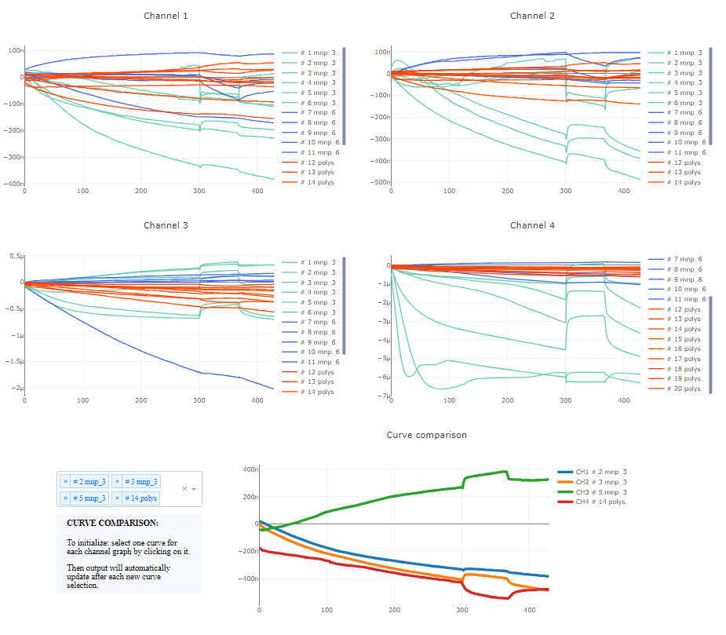

# Interactive dashboard for sensors channels comparison

An interactive dashboard to compare signal curves collected from a four channels sensor.



## Table of Contents

- [Project Overview](#project-overview)
- [Features](#features)
- [Getting Started](#getting-started)
  - [Prerequisites](#prerequisites)
  - [Installation](#installation)
- [License](#license)

## Project Overview

Create an interactive dashboard to compare the output of a four-channel sensor. Separately plots each channel curves. Through a dedicated interactive plot, enables direct comparison of tracks from different channels selecting them with a simple click.

I used this code to quickly plot and compare measurements during the optimization phase of TMek, a rapid diagnostic test for malaria, developed at Politecnico di Milano ([latest project scientific paper](https://ieeexplore.ieee.org/abstract/document/9924602)). 

## Features

- automatically and recursively plot .mat files starting from a root direcotry
- create interactive dashboard to look at single channels results and compares different channels results interactively

## Getting Started

The dashboard runs on a local server created using Dash. It is accessible using any browser. After lunching the __main__.py file, simply open the link to the local host tha will be generated.

- Python code lunching the web server:
     ```webapp.run_server(port=os.getenv("PORT", "9999"))```

- Example of the output url to open:
    *Running on http://127.0.0.1:9999*

### Prerequisites

The code was written using the following packages versions. Some features may not work on different versions of the packages.

At present the code only run with .mat extention files having the same structure of those reported in folder \data.

*packages name list and versions*

- dash             2.13.0
- numpy            1.22.3
- plotly           5.13.0
- pandas           1.4.2
- scipy            1.8.0

### Installation

To use the code simply clone the repo and lunch the __main__.py file

# License

This project is licensed under the MIT License. See the [LICENSE](LICENSE) file for details.